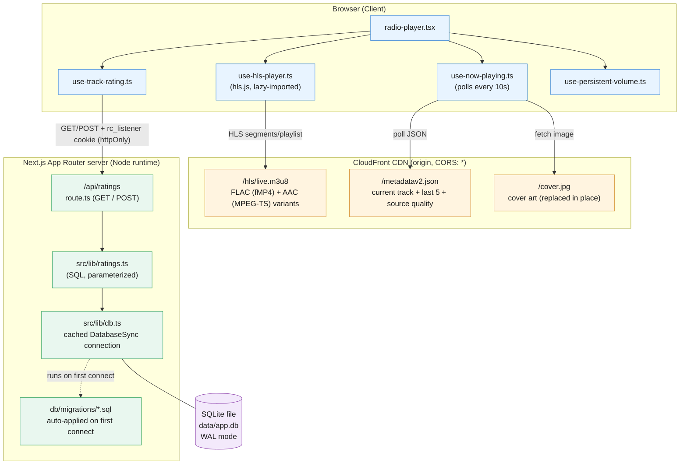
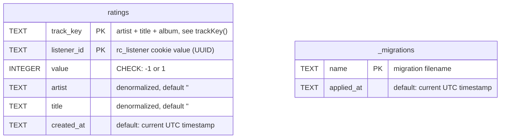
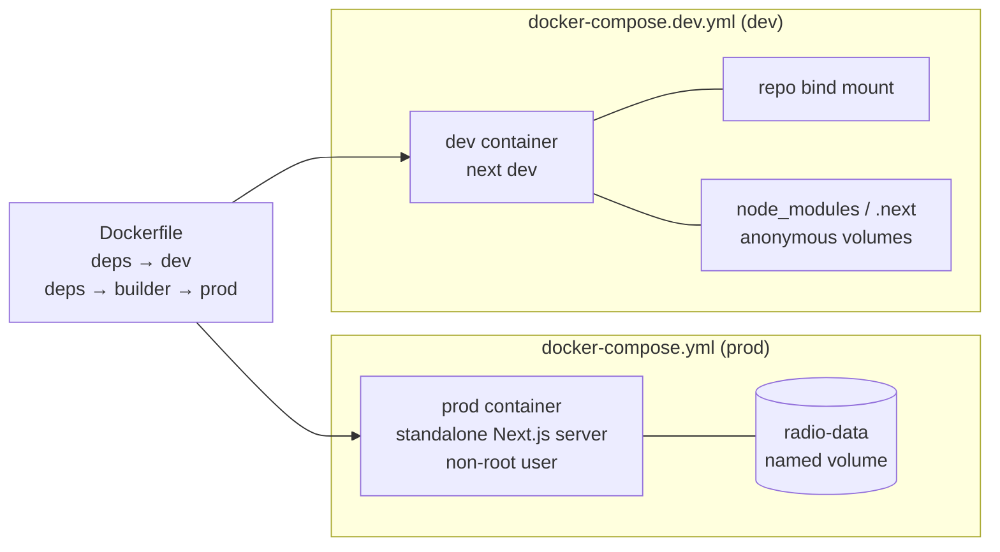

# Radio Calico — System Architecture

Mermaid diagram of the current system. Paste into Notion (Notion renders ` ```mermaid ` code
blocks natively) or any Mermaid-compatible viewer.



## Notes

- The browser talks **directly** to the CloudFront origin for streaming and metadata — no
  server-side proxy. The only server round-trip from the client is track ratings.
- `use-hls-player.ts` picks the FLAC (fMP4) variant by default via hls.js/MSE, falling back to
  AAC where FLAC isn't supported (notably Safari); see `AGENTS.md` for why this logic is
  deliberate and shouldn't be casually changed.
- Ratings are keyed on `trackKey(track)` (`src/lib/stream.ts`) + a per-listener `rc_listener`
  httpOnly cookie, enforced as one vote per listener per song via a DB constraint
  (`ON CONFLICT ... DO NOTHING`).
- `src/lib/db.ts` caches a single `DatabaseSync` connection on `globalThis` and applies any new
  files in `db/migrations/` before the app serves its first query.

## Database schema



- `ratings` is `WITHOUT ROWID`, with a composite primary key `(track_key, listener_id)` — this
  is what enforces "one vote per listener per song" at the DB layer, not just in application
  code. `rate()` (`src/lib/ratings.ts`) relies on this via
  `ON CONFLICT (track_key, listener_id) DO NOTHING`.
- `value` is constrained to `-1` or `1` (👎/👍) by a `CHECK` constraint.
- `artist`/`title` are denormalized onto each row (not joined from elsewhere) since there is no
  separate `tracks` table — the CDN origin is the source of truth for track metadata, and the
  DB only persists what's needed to render past ratings.
- `_migrations` is created automatically by `migrate()` (`src/lib/db.ts`) and tracks which files
  under `db/migrations/` have been applied, by filename, so migrations are idempotent across
  restarts.
- Defined in `db/migrations/001_add_ratings.sql`; schema changes are always new migration files
  (never edits to an applied one), applied automatically on first connection or via
  `npm run db:migrate`.

## Deployment (Docker)


